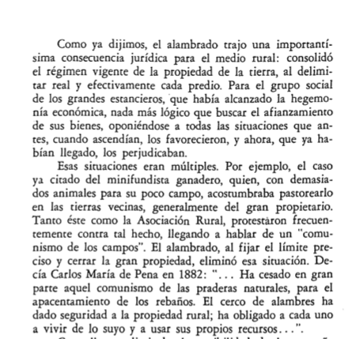

```{r setup, include=FALSE}
options(htmltools.dir.version = FALSE)
knitr::opts_chunk$set(
  fig.width=6, fig.height=3.5, fig.retina=3,
  out.width = "100%",
  cache = FALSE,
  echo = FALSE,
  message = FALSE, 
  warning = FALSE,
  hiline = TRUE,
  dev = "png", 
  dev.args = list(type = "cairo-png")
)

library(tibble)
library(ggplot2)
library(showtext)
library(purrr)
font_add_google("Lato", "Lato")
font_add_google("Merriweather", "Merriweather")
theme_set(theme_minimal(base_family = 'Lato', base_size=16))
source(here::here('utils.R'))

```

```{r xaringan-themer, include=FALSE, warning=FALSE}
library(xaringanthemer)


colores <- c(celeste="#5e82ae", 
             color3="#89a2c3",
             color1="#698BB4",
             color2="#5D81AD",
             verde="#4E7B7B")

# ,,5D81AD,,000000
style_mono_accent(
  base_color = "#5e82ae",
  #secondary_color = "",
  header_font_google = google_font("Lato"),
  text_font_google   = google_font("Merriweather"),
)
```


<style>

.center2 {
  margin: 0;
  position: absolute;
  top: 50%;
  left: 50%;
  -ms-transform: translate(-50%, -50%);
  transform: translate(-50%, -50%);
}

</style>


# ¿Por qué existen los gobiernos?


- Garantizan la propiedad privada, lo que permite que el mercado funcione.

- Asignan los recursos de la sociedad.

- Redistribuyen la riqueza y los ingresos de la sociedad.


---

# Bienes Públicos

- Los bienes económicos se pueden clasificar según:

  - Si son rivales o no rivales.
  
  - Si son excluibles o no excluibles.
  
<br />
  
  
|            |  Excluibles   |  No exclubiles |
|------------|:-------------:|---------------:|
| Rivales    | Bienes Privados      |  Recursos comunes|
| No Rivales | Monopolio Natural    |  Bienes Públicos |

---

# Externalidades y Bienes mixtos

- Hay bienes cuya producción o consumo genera impactos sobre terceros. 

- Estos impactos pueden ser positivos o negativos.

---

# Ineficiencias

- Estos bienes y servicios generan ineficiencias que pueden ser corregidas por la acción pública.

  - Provisión de bienes públicos
  
  - Conservación de recursos comunes
  
  - Regulación de monopolios naturales
  
---

# Free Riders y Bienes Públicos

- Como no es posible excluir personas de su consumo, los consumidores no tienen incentivos a pagar por ellos.

- Los __free riders__ son las personas que disfrutan de bienes públicos sin afrontar sus costos.

- Este problema hace que las economías tiendan a producir menos del bien que lo que sería socialmente óptimo.

---

## Provisión de Bienes Públicos

```{r}
msc_df <- tibble(x=c(0,  3), 
                 y=c(4, 2.5))

msb_df <- tibble(x=c(0,   3),
                 y=c(1, 2.5))


msc_fun <- splinefun(msc_df$x, msc_df$y)
msb_fun <- splinefun(msb_df$x, msb_df$y)

ggplot(data.frame(x=0, y=0)) + 
  geom_function(fun=msc_fun, xlim=c(0, 5.5)) +
  annotate("text", y=1.25, x=6, size=7, label="BMS") +
  geom_function(fun=msb_fun, xlim=c(0, 5.5)) +
  annotate("text", y=3.8, x=6, size=7, label="CMS") +
  geom_vline(xintercept = 0) +
  geom_hline(yintercept = 0) +
  scale_x_continuous(limits = c(0, 6)) + 
  marcar_punto(0, 0) +
  annotate("text", y=.9, x=1.5, size=7, label="Eq. Privado") +
  annotate(
    geom = "curve", x = .75, y = .7, xend = .1, yend = .1, 
    curvature = .1, arrow = arrow(length = unit(2, "mm"))
  ) +
  marcar_punto(3, 2.5) +
  annotate("text", y=3.8, x=4, size=7, label="Eq. Eficiente") +
  annotate(
    geom = "curve", 
    x = 3.5, y = 3.5, 
    xend = 3, yend = 2.7, 
    curvature = .1, arrow = arrow(length = unit(2, "mm"))
  ) +
  labs( x="Cantidad", y="Precio y Costo Social")

```


---
class: inverse, center, middle

# Estudio de caso
---
background-image: url(imgs/yalta.png)


 

---
<style>
blockquote {
  margin-top: 4em;
}
</style>
> <p>Los estudiosos de la Guerra Fría saben que, para impedir una posible agresión soviética, Estados Unidos colocó un “paraguas estratégico” sobre la Europa de la OTAN y Japón, declarando que lucharía si la Unión Soviética amenazaba la indepen- dencia de estos países. Los aliados europeos y japoneses han obtenido un provecho económico del hecho de que Estados Unidos suministraba la mayor parte de su seguridad nacional.</p>
<p>
Durante el mandato del presidente Ronald Reagan, aproximadamente 6 por ciento del PIB de Estados Unidos se invertía en defensa, en tanto que los europeos gastaban en este rubro sólo 2 a 3 por ciento y los japoneses un miserable 1 por ciento, aunque todos enfrentaban un enemigo común. </p>
<p>Por lo tanto, el contribuyente estadounidense soportaba una carga desproporcionada en el gasto general de defensa, en tanto que los que se cobijaban bajo su paraguas invertían más en bienes públicos o de consumo, o ahorraban; mientras, Estados Unidos se endeudaba cada vez más. Actualmente, Estados Unidos, al igual que Roma y Gran Bretaña en su época, es el proveedor de bienes públicos internacionales.</p>

_International Herald Tribune_ 30 de enero de 2008
  
---
# Bienes mixtos

- Existen pocos bienes públicos puros.

- Muchos bienes tienen impactos sobre terceros que no estan involucrados en la transacción.

- Decimos que estos bienes son mixtos, y generan externalidades positivas o negativas.

---
# Beneficio Privado y Social

- En estos casos el Beneficio Marginal Social es mayor al Beneficio Marginal Privado. 

- La diferencia entre el Beneficio Marginal Social y el Beneficio Marginal Privado es el beneficio externo.


---
# Mercado de educación terciaria

```{r}
mpb_df <- tibble(x=c(0,  15), 
                 y=c(20, 10))

msb_df <- tibble(x=c(5,   15),
                 y=c(40, 25))


mpb_fun <- splinefun(mpb_df$x, mpb_df$y)
msb_fun <- splinefun(msb_df$x, msb_df$y)

ggplot(data.frame(x=0, y=0)) + 
  geom_function(fun=mpb_fun, xlim=c(0, 24)) +
  annotate("text", y=5, x=28, size=7, label="BMP") +
  geom_function(fun=msb_fun, xlim=c(5, 24)) +
  annotate("text", y=15, x=28, size=7, label="BMS") +
  geom_vline(xintercept = 0) +
  geom_hline(yintercept = 0) +
  scale_x_continuous(limits = c(0, 30)) + 
  marcar_punto(15, 10) +
  marcar_punto(15, 25)  + 
  labs(x="Cantidad", y="Precio y Costo Social", 
       title="")
```

---

# Mercado de educación terciaria (2)

- Si tenemos 15 millones de estudiantes, el beneficio privado es $ 10.000 por estudiante, y hay un beneficio externo de $ 15.000.

- El beneficio social por estudiante es de $ 25.000

---

# Equilibrio ineficiente

```{r}

msc_df <- tibble(x=c(0,   15),
                 y=c(5, 25))


msc_fun <- splinefun(msc_df$x, msc_df$y)


plt <- ggplot(data.frame(x=0, y=0)) + 
  geom_function(fun=mpb_fun, xlim=c(0, 24)) +
  annotate("text", y=5, x=28, size=5, label="BMP") +
  geom_function(fun=msb_fun, xlim=c(5, 24)) +
  annotate("text", y=15, x=28, size=5, label="BMS") +
  geom_function(fun=msc_fun, xlim=c(0, 24)) +
  annotate("text", y=35, x=28, size=5, label="MSC") +
  geom_vline(xintercept = 0) +
  geom_hline(yintercept = 0) +
  scale_x_continuous(limits = c(0, 30),
                     breaks=c(0, 5, 10, 15, 20, 25, 30)) + 
  marcar_punto(7.5, 15) +
  labs(x="Cantidad", y="Precio y Costo Social", 
       title="")

plt

```

---
# Pérdida de eficiencia

```{r}
plt +
  marcar_punto(15, 25) + 
  geom_ribbon(aes(x=x, ymin=msc, ymax=msb), 
              alpha=.4,
              data=tibble(x=7.5:15, 
                          msc=msc_fun(x),
                          msb=msb_fun(x)))

```


---

# Solución Eficiente

- Provisión Pública

- Subsidio

---

# Externalidades Negativas

- Costo Privado (marginal)

- Costo Social (marginal)

- Costo Externo

---
# Valorando costos externos

- Turismo en un río contaminado.

---
background-image: url(imgs/cianobacterias-01.jpeg)
background-size: contain
background-position: top-left


.pull-left[

]
---

# Análisis

```{r}
curvas <- list(
  cmg_soc=tribble(
    ~x, ~y, 
    0,   400,
    4,   1200),
  cmg_priv=tribble(
    ~x, ~y,
    6,   1000, 
    0,   400),
  demanda=tribble(
    ~x, ~y,
    4,   1200,
    6,   1000)) %>% 
  map(~splinefun(.x$x,.x$y))
  

p1 <- data.frame(x=0, y=0) %>% 
  ggplot(aes(x, y)) + 
  geom_function(fun=curvas$cmg_soc, xlim=c(0, 7)) +
  annotate("text", y=1800, x=8.5, size=6, label="CMG Social") +
  geom_function(fun=curvas$cmg_priv, xlim=c(0, 8)) +
  annotate("text", y=1300, x=8.5, size=6, label="CMG Privado") +
  scale_x_continuous(breaks=seq(0, 10, by=2),
                     limits=c(0, 10)) +
  scale_y_continuous(breaks=seq(0, 2000, by=200),
                     limits=c(0, 1800)) +
  labs(x="Cantidad", y="Precio y Costos") + 
  geom_vline(xintercept = 0) +
  geom_hline(yintercept = 0) 

p1

# p2 <- p + 
#   marcar_punto(4, 1200) +
#   marcar_punto(6, 1000) 


```

---
# Equilibrio de mercado

```{r}
p2 <- p1 + 
  geom_function(fun=curvas$demanda, xlim=c(0, 8)) +
  annotate("text", y=750, x=8, size=6, label="Demanda")

p2 +
  marcar_punto(6, 1000) +
  labs(caption="El equilibrio de mercado se solo toma en cuenta el costo privado")
```


---
# Equlibrio eficiente
```{r}
p2 + 
  marcar_punto(4, 1200) +
  labs(caption="Si tomamos en cuenta los costos externos, el equilibrio eficiente es con una menor cantidad producida")
```

---
# Pérdida de eficiencia

```{r}
p2 + 
  marcar_punto(4, 1200) +
  marcar_punto(6, 1000) +
  geom_ribbon(aes(x=x, ymin=demanda, ymax=cmg_soc), 
              alpha=.4,
              inherit.aes = FALSE,
              data=tibble(x=4:6, 
                          cmg_soc=curvas$cmg_soc(x),
                          demanda=curvas$demanda(x))) +
  labs(caption="Hay una pérdida de eficiencia debido al exceso de producción")
  
```

---
# Equilibrio eficiente con un impuesto

```{r}
p2 + 
  marcar_punto(4, 1200) +
  marcar_punto(4, 800) + 
  geom_ribbon(aes(x=x, ymin=800, ymax=1200), 
              alpha=.4,
              inherit.aes = FALSE,
              data=tibble(x=0:4)) +
  labs(caption="Un impuesto de $400 por unidad lleva el mercado al equilibrio eficiente")
```

---
# Impuesto

- Para decidir cuanto produce, el productor debe tomar en cuenta el costo marginal y el nuevo impuesto.

- La cantidad de equilibrio es la que iguala el costo marginal sumado al impuesto con lo que paga el consumidor.

---
# Recursos de propiedad común

- Son recursos no excluibles pero rivales.

- Muchos recursos naturales tienen esas características.

---
background-image: url(imgs/alambrado.png)
background-size: contain
# Agro Uruguay siglo XIX

.pull-right[


]

---
# Análisis

- Es similar al de las externalidades negativas.

- El productor no tiene incentivos de preservar el recurso común, por lo que tiende a sobreexplotarlo.

